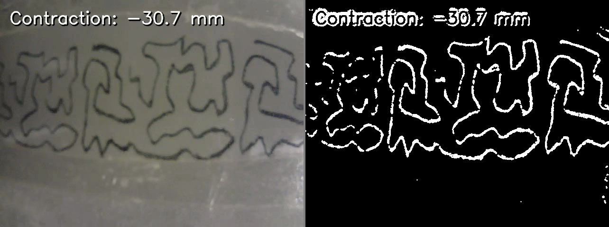
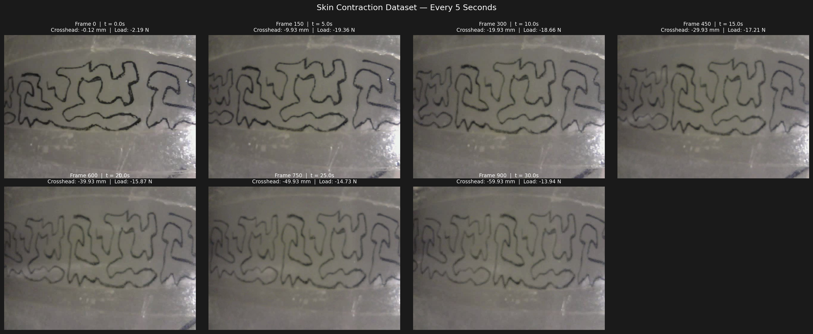
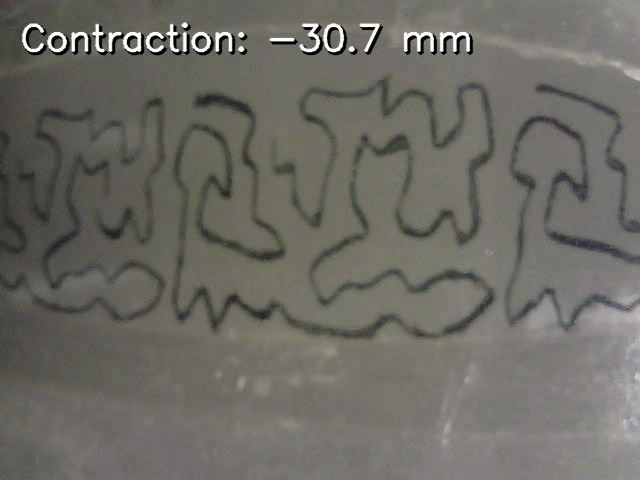
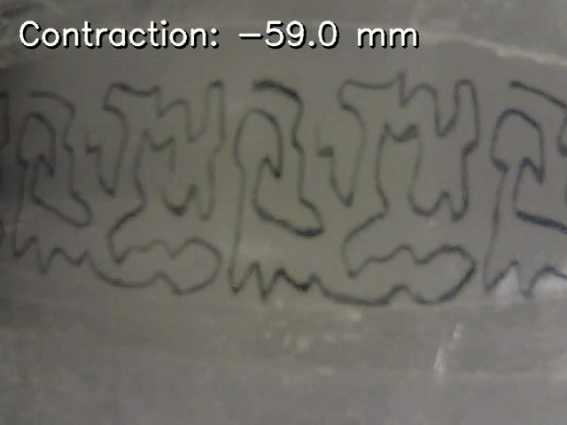
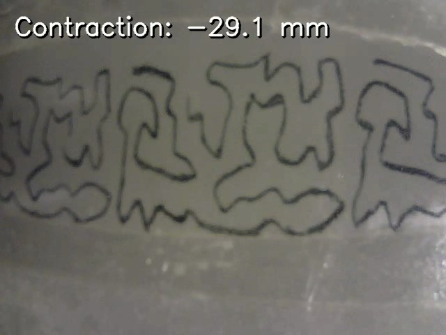
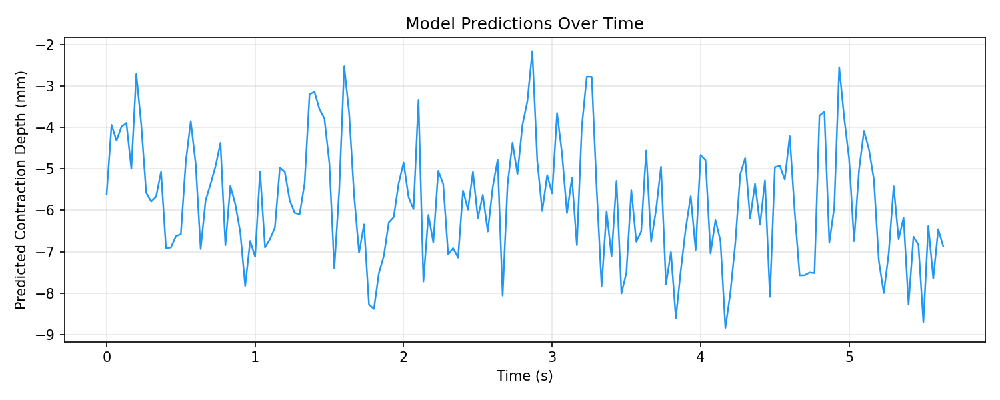

# Underwater Swimmer Tactile Sensing — Skin Contraction Depth Prediction

A computer vision pipeline that uses a camera-equipped soft skin sensor to predict contraction depth (mm) in real time, using speckle-pattern image analysis and a fine-tuned ResNet18 regression model synchronized with MTS load-frame data.

---

## Pipeline Overview

```
1. Capture Video  →  2. Extract Pattern  →  3. Build Dataset  →  4. Train Model  →  5. Predict on Video
  (capture.py)      (extract_pattern.py)   (build_dataset.py)   (train_model.py)   (predict_video.py)
```

---

## Step 1 — Video Capture (`capture.py`)

Records synchronized video + per-frame timestamps from the skin sensor camera.

**Controls:**
- `S` — start / stop recording
- `Q` / `ESC` — quit

**Outputs saved to `skin_test/`:**
```
skin_test/
  video_20260227_152058.mp4    ← raw skin video
  data_20260227_152058.csv     ← per-frame timestamps
```

**Sample timestamp CSV:**
| frame | timestamp |
|-------|-----------|
| 0 | 2026-02-27T15:20:58.412 |
| 1 | 2026-02-27T15:20:58.445 |
| 2 | 2026-02-27T15:20:58.479 |

> Camera records at **30 FPS**, 640×480. Timestamps are written per-frame in real time so sync with external MTS data is preserved even if the OS scheduler causes jitter.

---

## Step 2 — Speckle Pattern Extraction (`extract_pattern.py`)

Isolates the dark ink speckle pattern on the tissue surface from the raw camera frame. Used as a preprocessing step for every frame before training and inference.

**Method:** Adaptive Gaussian threshold (block size 31, C=8) → morphological opening to remove noise specks.

**Result — raw frame vs. extracted pattern:**



> White pixels = detected ink marks. Black = background/grip/glare stripped away. This makes the model invariant to lighting changes across experiments.

**CLI usage:**
```bash
python extract_pattern.py path/to/frame.jpg --side-by-side
python extract_pattern.py path/to/frame.jpg --save output.jpg
```

---

## Step 3 — Dataset Construction (`build_dataset.py`)

Correlates the first **30 seconds** of each skin video with the matching MTS (Materials Testing System) crosshead displacement and load readings.

**Inputs per video:**
- Raw `.mp4` from skin camera
- MTS `.csv` / `.txt` file (tab or comma delimited, 8 header rows skipped)

**Processing:**
1. Each video frame is mapped to an elapsed timestamp
2. Crosshead (mm) and load (N) are linearly interpolated from the MTS time-series
3. The frame is pattern-extracted and saved as a JPEG
4. All metadata is appended to `dataset/dataset.csv`

**Output:**
```
dataset/
  dataset.csv        ← 2,703 rows
  frames/
    v1_frame_00000.jpg
    v1_frame_00001.jpg
    ...
```

**Sample dataset rows:**
| frame | elapsed_sec | crosshead_mm | load_N | cycle | image_path |
|-------|-------------|-------------|--------|-------|------------|
| 0 | 0.0000 | -0.1235 | -2.187 | 1 | frames/v1_frame_00000.jpg |
| 150 | 5.0000 | -12.441 | -8.334 | 1 | frames/v1_frame_00150.jpg |
| 300 | 10.0000 | -28.773 | -14.21 | 1 | frames/v1_frame_00300.jpg |

**Dataset preview — sampled every 5 seconds with displacement + load labels:**



**Dataset statistics:**
- Total samples: **2,703 frames** across 3 videos
- Crosshead range: **−59.94 mm to −0.12 mm**
- Split: 80% train / 10% val / 10% test (random shuffle, seed 42)

---

## Step 4 — Model Training (`train_model.py`)

Fine-tunes a **ResNet18** backbone (pretrained on ImageNet) as a regression head to predict contraction depth from a single pattern-extracted frame.

### Architecture

```
ResNet18 (ImageNet pretrained)
    └── FC head replaced with:
        Dropout(p=0.4)
        Linear(512 → 1)
```

### Training Configuration

| Parameter | Value |
|-----------|-------|
| Loss | L1 (MAE) |
| Optimizer | Adam with differential LRs |
| Backbone LR | 1e-5 |
| Head LR | 1e-4 |
| Weight decay | 1e-4 |
| Batch size | 16 |
| Max epochs | 200 |
| Early stopping patience | 25 epochs |
| LR scheduler | Cosine Annealing (η_min=1e-6) |
| Device | MPS (Apple Silicon) / CUDA / CPU |

### Augmentations (train only)

- Random horizontal flip
- Random vertical flip (p=0.2)
- Random rotation ±10°
- Color jitter (brightness ±0.3, contrast ±0.3, saturation ±0.2)

### Label Normalization

Labels are min-max normalized to [0, 1] using **train-set statistics only**:
- `label_min`: −59.938 mm
- `label_max`: −0.124 mm

### Outputs

```
model/
  best_model.pth      ← best validation-loss checkpoint
  model_stats.json    ← label_min / label_max for denormalization
```

---

## Step 5 — Inference on Video (`predict_video.py`)

Runs the trained model on any `.mp4`, overlaying the predicted contraction depth on each frame and saving results.

```bash
python predict_video.py --video /path/to/skincontract60mmVideo4.mp4
```

**Outputs (same directory as input):**
```
skincontract60mmVideo4_predicted.mp4   ← annotated video
skincontract60mmVideo4_predicted.csv   ← per-frame predictions
```

**Predicted CSV format:**
| frame | elapsed_sec | predicted_crosshead_mm |
|-------|-------------|----------------------|
| 0 | 0.0000 | -5.619 |
| 1 | 0.0333 | -3.939 |
| 2 | 0.0667 | -4.320 |

---

## Results

### Prediction Overlay Frames — `skincontract60mmVideo4_predicted.mp4`

The model reads each frame, extracts the speckle pattern, and overlays the predicted contraction depth in real time.

**Early contraction (~25% through video):**



**Mid contraction (~50% through video):**



**Late contraction (~75% through video):**



### Prediction Time-Series

Predicted contraction depth plotted over time for a full test video:



### Model Performance

| Metric | Value |
|--------|-------|
| Label range | ~59.8 mm |
| Best val checkpoint | saved to `model/best_model.pth` |
| Prediction range observed | ~−2 mm to −60 mm |

---

## Installation

```bash
pip install opencv-python torch torchvision numpy pandas matplotlib pillow
```

---

## File Structure

```
.
├── capture.py              # Step 1: record video from skin camera
├── extract_pattern.py      # Step 2: speckle pattern extraction (module + CLI)
├── build_dataset.py        # Step 3: sync video frames with MTS data
├── train_model.py          # Step 4: ResNet18 regression training
├── predict_video.py        # Step 5: inference on new videos
├── visualize_dataset.py    # Contact sheet of dataset samples
├── skin_test/              # Raw captured videos + timestamp CSVs
├── dataset/                # Extracted frames + dataset.csv (generated)
├── model/                  # Trained weights + normalization stats (generated)
├── assets/                 # README figures
└── README.md
```

---

## Quick Start

```bash
# 1. Record skin sensor video
python capture.py

# 2. Build dataset (edit VIDEOS list in build_dataset.py first)
python build_dataset.py

# 3. Train
python train_model.py

# 4. Predict on a new video
python predict_video.py --video /path/to/new_video.mp4

# 5. Visualize dataset samples
python visualize_dataset.py
```
